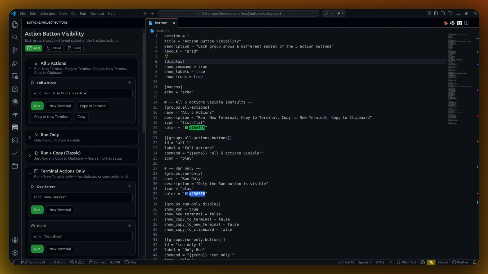
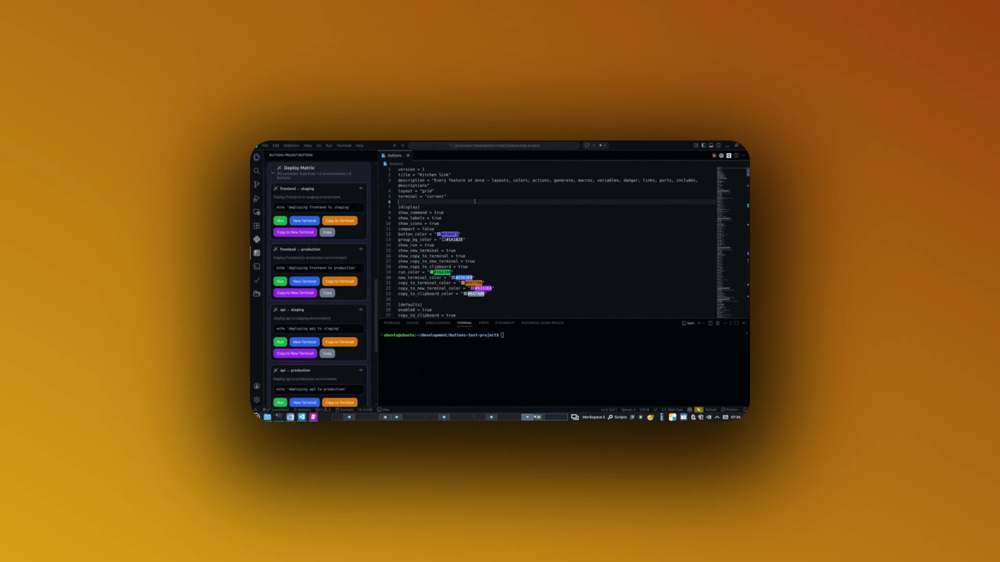
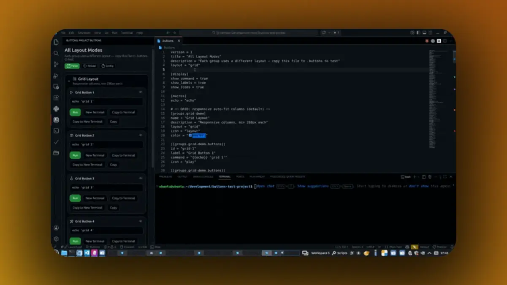
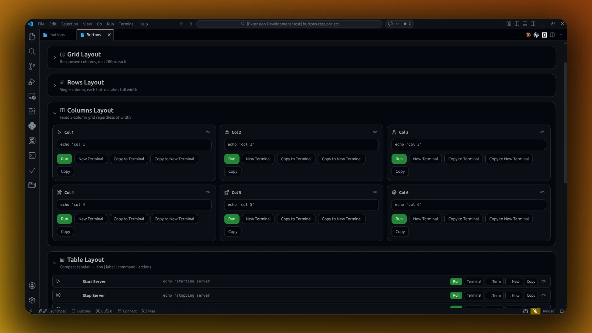
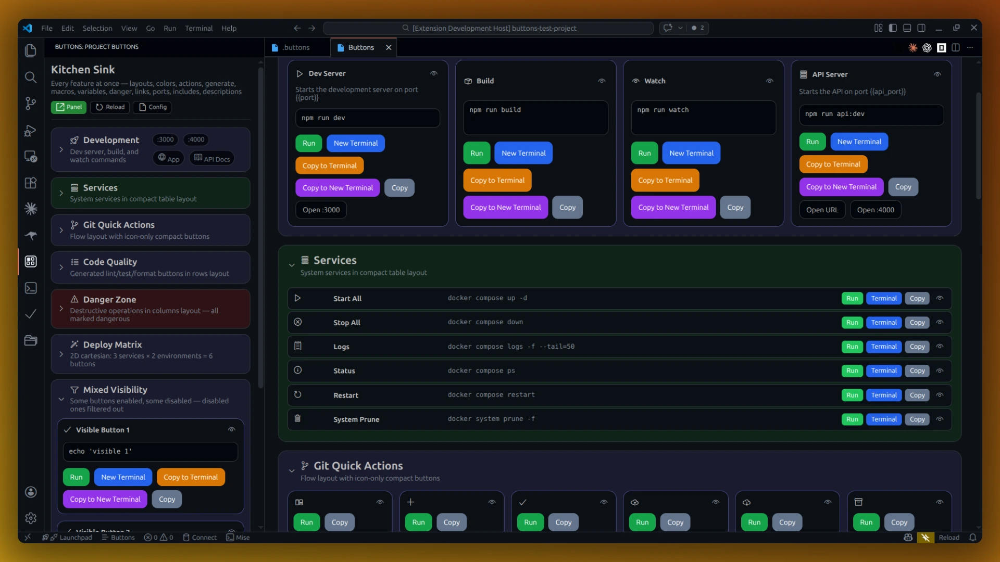

# Buttons

Buttons is an extension for VS Code and VS Codium that turns `.buttons` TOML files into a visual command panel inside the editor. Teams define common workflows once and expose them as clickable actions to run in the terminal, copy to the clipboard, or open related URLs and local ports. Individual developers can also keep a personal `~/.buttons` file with commands available across all projects.

**Install from the [VS Code Marketplace](https://marketplace.visualstudio.com/items?itemName=buttons-dev.buttons-vscode) or [Open VSX Registry](https://open-vsx.org/extension/buttons-dev/buttons-vscode) (VS Codium).**



## What It Solves

Projects usually keep important commands scattered across `package.json`, Docker docs, onboarding guides, shell history, and README snippets. Buttons gives those commands one shared surface inside VS Code so developers can discover and run them without hunting.

### Run commands from a visual panel



### Customize with a simple TOML file



## Features

- **Project buttons** — parse a `.buttons` file from the workspace root
- **User buttons** — personal `~/.buttons` file available in every project
- **Source tabs** — toggle between project and user buttons in the panel
- **5 layout modes** — grid, rows, columns, table, and flow



- **Accordion groups** — collapse and expand groups with persistent state
- **Eye toggle** — hide individual buttons from the panel
- **Custom colors** — per-button, per-group, and global color theming
- **Run commands** in the current or a new terminal
- **Copy** resolved commands to the clipboard
- **Open** related URLs and localhost ports
- **Static and generated buttons** — cartesian product expansion
- **Variables and macros** — simple string substitution with cycle detection
- **Danger detection** — automatic flagging and confirmation for destructive commands
- **Activity Bar icon** — sidebar panel for quick access
- **Toolbar icon** — quick-access button in the editor title bar
- **Compact mode** — dense layout option for large configs



## Quick Start

1. Install from the VS Code Marketplace or Open VSX Registry.
2. Create a `.buttons` file at the root of your project.
3. The Buttons sidebar appears automatically.
4. Click **Run**, **New Terminal**, or **Copy** on any button.

```toml
version = 1
title = "My Project"
layout = "grid"

[display]
show_command = true
show_icons = true

[groups.dev]
name = "Development"
icon = "rocket"

[[groups.dev.buttons]]
id = "start"
label = "Start Dev Server"
command = "npm run dev"
icon = "play"

[[groups.dev.buttons]]
id = "build"
label = "Build"
command = "npm run build"
icon = "package"
```

## Documentation

- [Getting Started](docs/GETTING-STARTED.md) — first-use walkthrough
- [.buttons File Reference](docs/BUTTONS-FILE.md) — complete TOML schema
- [Layouts](docs/LAYOUTS.md) — grid, rows, columns, table, and flow
- [UI Features](docs/UI-FEATURES.md) — accordion, eye toggle, colors, and more
- [User Profile](docs/USER-PROFILE.md) — personal `~/.buttons` file
- [Settings & Commands](docs/SETTINGS.md) — VS Code settings and commands
- [Examples](docs/EXAMPLES.md) — 29 example packs for every stack
- [Troubleshooting](docs/TROUBLESHOOTING.md) — common issues and fixes

## Safety

Buttons can run shell commands defined in `.buttons` files. Keep these points in mind:

- **Review project configs before use.** A `.buttons` file can run any shell command. Treat it like a Makefile or `package.json` script — inspect before trusting.
- **Dangerous command confirmation.** Commands containing destructive keywords (`rm -rf`, `drop`, `--force`, etc.) are flagged automatically. The extension prompts for confirmation before running them.
- **User config is personal.** Your `~/.buttons` file is under your control and is never shared with the project.

## Development

```bash
npm install
npm run compile
npm test
npm run watch    # continuous compilation
```

Press F5 in VS Code to launch the Extension Development Host. See [CLAUDE.md](CLAUDE.md) for full architecture details.

## License

MIT. See [LICENSE](LICENSE).
