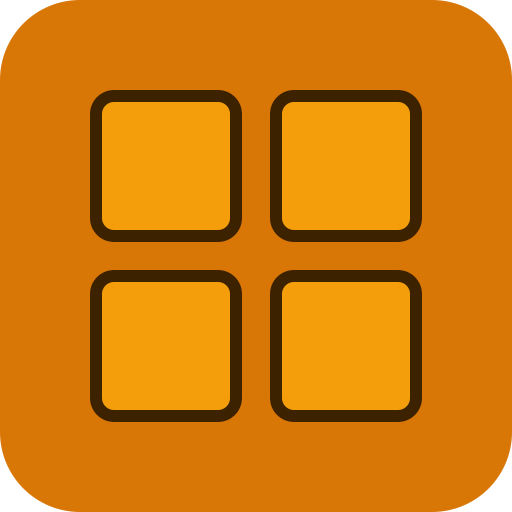

<p align="center"></p>

# Buttons

Buttons is a VS Code extension that turns `.buttons` TOML files into a visual command panel inside the editor.

Teams define common workflows once and expose them as clickable actions to **run in the terminal**, **copy to the clipboard**, or **open related URLs and local ports**. Individual developers can also keep a personal `~/.buttons` file with commands available across all projects.

## Why Buttons?

Projects usually keep important commands scattered across `package.json`, Docker docs, onboarding guides, shell history, and README snippets. Buttons gives those commands one shared surface inside VS Code so developers can discover and run them without hunting.

## Features

- **Project buttons** — parse a `.buttons` file from the workspace root
- **User buttons** — personal `~/.buttons` file available in every project
- **Source tabs** — toggle between project and user buttons in the panel
- **5 layout modes** — grid, rows, columns, table, and flow
- **Accordion groups** — collapse and expand groups with persistent state
- **Eye toggle** — hide individual buttons from the panel
- **Custom colors** — per-button, per-group, and global color theming
- **Run commands** in the current or a new terminal
- **Copy** resolved commands to the clipboard
- **Open** related URLs and localhost ports
- **Static and generated buttons** — cartesian product expansion
- **Variables and macros** — simple string substitution with cycle detection
- **Danger detection** — automatic flagging and confirmation for destructive commands
- **Activity Bar icon** — sidebar panel for quick access
- **Toolbar icon** — quick-access button in the editor title bar
- **Compact mode** — dense layout option for large configs

## Quick Start

1. Install the extension from the VS Code Marketplace.
2. Create a `.buttons` file at the root of your project.
3. The Buttons sidebar appears automatically.
4. Click **Run**, **New Terminal**, or **Copy** on any button.

```toml
version = 1
title = "My Project"
layout = "grid"

[display]
show_icons = true
show_labels = true

[groups.dev]
name = "Development"
icon = "rocket"

[[groups.dev.buttons]]
id = "start"
label = "Start Dev Server"
command = "npm run dev"
icon = "play"

[[groups.dev.buttons]]
id = "build"
label = "Build"
command = "npm run build"
icon = "package"
```

## Personal User Buttons

Create a `~/.buttons` file in your home directory to add buttons available across all projects. When both a project and user file exist, tabs appear in the panel to switch between them.

See [User Profile](USER-PROFILE.md) for details.

## Documentation

- [Getting Started](GETTING-STARTED.md) — first-use walkthrough
- [.buttons File Reference](BUTTONS-FILE.md) — complete TOML schema
- [Layouts](LAYOUTS.md) — grid, rows, columns, table, and flow
- [UI Features](UI-FEATURES.md) — accordion, eye toggle, colors, and more
- [User Profile](USER-PROFILE.md) — personal `~/.buttons` file
- [Settings & Commands](SETTINGS.md) — VS Code settings and commands
- [Examples](EXAMPLES.md) — 29 example packs for every stack
- [LLM Instructions](LLM-INSTRUCTIONS.md) — prompt for AI agents to generate `.buttons` files
- [Troubleshooting](TROUBLESHOOTING.md) — common issues and fixes
